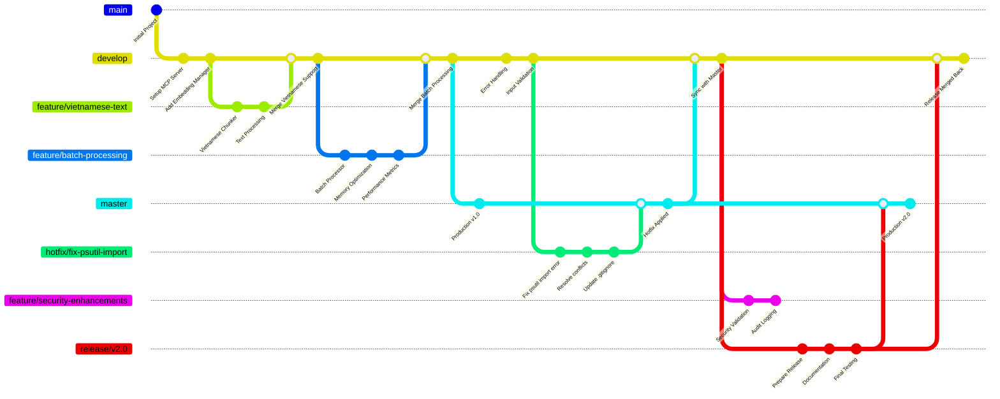

# Python Coding Standards & AI Instructions

## General Coding Standards

- Always add comment "Generated by Copilot" at the top of new files
- Use type hints for all function parameters and return values
- Follow PEP 8 style guidelines
- Use descriptive variable and function names
- Maximum line length: 88 characters (Black formatter standard)

## Code Quality

- Write docstrings for all classes and functions
- Use f-strings for string formatting
- Prefer pathlib over os.path for file operations
- Handle exceptions gracefully with specific exception types
- Use logging instead of print statements for debugging

## Project Specific Guidelines

- This is a ChromaDB MCP (Model Context Protocol) server
- Focus on vector database operations and embeddings
- Optimize for memory usage and performance
- Use async/await for I/O operations when possible

## AI Behavior Instructions

- **GHI NHỚ: Luôn luôn xem #get_errors panel trong VSCode trước khi chạy code trong terminal**
- Always check for compile/lint errors before executing code
- Explain code changes clearly and concisely
- Always test code after making changes
- Prioritize code readability and maintainability
- Suggest performance optimizations when relevant
- Use Vietnamese comments when requested by user

## Error Prevention Workflow

1. **BƯỚC 1**: Kiểm tra #get_errors panel trong VSCode
2. **BƯỚC 2**: Fix tất cả errors và warnings trước khi run
3. **BƯỚC 3**: Validate syntax và imports
4. **BƯỚC 4**: Không còn lỗi nữa mới được phép chạy code trong terminal
5. **BƯỚC 5**: Monitor runtime errors và handle gracefully

## Dependency Management

- Handle optional dependencies gracefully with try/except imports
- Add clear error messages when required packages are missing
- Use fallback strategies when optional packages unavailable
- Example pattern:
  ```python
  try:
      import optional_package
      HAS_OPTIONAL = True
  except ImportError:
      optional_package = None
      HAS_OPTIONAL = False
      logger.warning("Optional package not available, some features disabled")
  ```

## Module Structure Guidelines

- Create comprehensive `__init__.py` files with clear exports
- Use `__all__` to control public API
- Organize modules by functionality (utils/, embedding/, etc.)
- Provide both high-level classes and convenience functions
- Document module purpose and features in module docstring

## Vietnamese Text Handling

- Use Unicode normalization (NFC) for Vietnamese text
- Implement Vietnamese-specific text processing patterns
- Consider Vietnamese sentence/paragraph boundaries
- Support Vietnamese stop words and linguistic features
- Example patterns for Vietnamese text processing

## Testing and Validation Patterns

Luôn sử dụng thư mục `tests` để viết test.

- Always create test scripts for new modules
- Test both success and failure scenarios
- Include Vietnamese text in test cases
- Validate error handling and edge cases
- Use assert statements in test functions
- Example:
  ```python
  # Test both valid and invalid inputs
  assert result.is_valid == True
  assert len(result.errors) == 0
  ```

### Test File Cleanup Workflow

**QUAN TRỌNG**: Sau khi testing xong, luôn dọn dẹp test files để giữ workspace sạch sẽ.

#### Cách 1: Sử dụng VS Code Task (Khuyến nghị)
```bash
# Chạy task có sẵn để xóa tất cả test files
Ctrl+Shift+P → "Tasks: Run Task" → "Clean Test Files"
```

#### Cách 2: Sử dụng Terminal
```powershell
# Xóa tất cả test files trong workspace
python .tools\clean_test_file_in_workspace.py
```

#### Cách 3: Xóa thủ công
```powershell
# Xóa file test cụ thể
Remove-Item "test_*.py" -Force
```

**Lưu ý**: Task "Clean Test Files" sẽ tự động:
- Quét toàn bộ workspace để tìm file `test_*.py`
- Xóa tất cả test files tạm thời
- Báo cáo số lượng file đã xóa
- Bảo toàn các file test production quan trọng

**Best Practice**: 
- Luôn chạy task cleanup sau mỗi session testing
- Không commit test files tạm thời vào git
- Chỉ giữ lại test files chính thức trong thư mục `tests/`

## Error Recovery Strategies

- Implement graceful degradation when dependencies missing
- Provide meaningful error messages with suggested solutions
- Use fallback implementations when possible
- Log warnings for non-critical failures
- Maintain service availability even with partial functionality

## Performance Optimization Guidelines

- Use async/await for I/O bound operations
- Implement caching strategies (LRU, TTL)
- Monitor memory usage and implement cache eviction
- Batch processing for large datasets
- Lazy loading for expensive resources
- Profile and measure performance improvements

## Integration Patterns

- Design modules to work independently and together
- Use dependency injection for better testability
- Create orchestrator classes for complex workflows
- Implement proper separation of concerns
- Example integration pattern:

  ```python
  # Individual modules work standalone
  validator = ValidationOrchestrator()
  chunker = TextChunker()

  # But can be combined for complex workflows
  def process_documents(docs):
      validated = validator.validate_documents(docs)
      if validated.is_valid:
          return chunker.chunk_texts(validated.sanitized_data)
  ```

## ChromaDB Specific Guidelines

- Validate collection names according to ChromaDB requirements
- Handle vector dimensions and embeddings properly
- Implement proper metadata validation
- Use appropriate chunk sizes for embeddings
- Consider Vietnamese text when chunking for embeddings
- Test with actual ChromaDB operations

## Development Workflow Enhancements

- Use PYTHONPATH for testing during development
- Create comprehensive test scripts for each module
- Test integration between modules
- Validate both individual and combined functionality
- Monitor resource usage during development
- Use meaningful logging levels (DEBUG, INFO, WARNING, ERROR)

## Code Organization Best Practices

- Group related functionality into modules (validation, metrics, embedding)
- Create both detailed classes and simple convenience functions
- Use global instances for commonly used objects (e.g., `validator`, `auth_manager`)
- Implement proper caching and resource management
- Design for both synchronous and asynchronous usage
- Example module structure:
  ```
  src/
  ├── utils/          # Cross-cutting utilities
  ├── embedding/      # Embedding-specific functionality
  ├── server.py       # Main MCP server
  └── tools.py        # MCP tool implementations
  ```

### Code Refactoring Workflow

Khi cần refactor hoặc thu gọn code lớn:

#### 1. **Safety Backup Strategy**
```powershell
# Tạo backup file trước khi refactor
copy original_file.py original_file_backup.py

# Tạo version mới để test
# ... refactor code ...
# Lưu thành original_file_cleaned.py
```

#### 2. **Testing & Validation**
```powershell
# Test version mới thoroughly
python test_new_version.py

# So sánh functionality cũ vs mới
# Đảm bảo không có regression
```

#### 3. **Deployment & Cleanup**
```powershell
# Khi confirm version mới OK:
copy original_file_cleaned.py original_file.py

# Dọn dẹp files tạm thời
del original_file_backup.py
del original_file_cleaned.py
del test_*.py
```

#### 4. **Best Practices**
- **Luôn backup trước khi refactor lớn**
- **Test thoroughly trước khi replace**
- **So sánh line count và file size**
- **Validate tất cả functionality**
- **Dọn dẹp files tạm sau khi xong**
- **Commit changes với clear message**

**Example từ thực tế**:
```
tools.py (567 lines) → tools_backup.py (backup)
                   → tools_cleaned.py (456 lines, optimized)
                   → tools.py (updated, tested)
                   → cleanup: del backup & cleaned files
```

## Quality Assurance Checklist

Before committing code, ensure:

- [ ] All imports work correctly (handle optional dependencies)
- [ ] Error cases are handled gracefully
- [ ] Type hints are complete and accurate
- [ ] Docstrings explain purpose and usage
- [ ] Test cases cover both success and failure scenarios
- [ ] Vietnamese text handling works correctly
- [ ] Performance is acceptable for expected usage
- [ ] Memory usage is reasonable
- [ ] Integration with other modules works smoothly

## Thử nghiệm code với sandbox

Nếu file gặp nhiều lỗi thì có thể thử nghiệm trong `tests/sandbox` sau đó merge code vào.

- Thử nghiệm xong phải xóa file trong sandbox.

## Git Branching hiệu quả

- **master**: production

- **develop**: tích hợp các tính năng

- **feature/**: phát triển tính năng

- **release/**: chuẩn bị phát hành

- **hotfix/**: sửa lỗi khẩn cấp
  Ví dụ mẫu:



## Terminal sử dụng powershell trong windows

