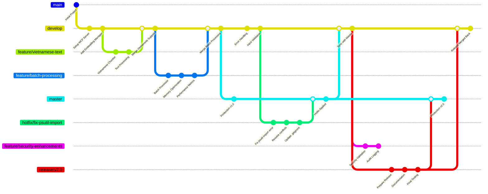

# Python Coding Standards & AI Instructions

## General Coding Standards

- Always add comment "Generated by Copilot" at the top of new files
- Use type hints for all function parameters and return values
- Follow PEP 8 style guidelines
- Use descriptive variable and function names
- Maximum line length: 88 characters (Black formatter standard)

## Code Quality

- Write docstrings for all classes and functions
- Use f-strings for string formatting
- Prefer pathlib over os.path for file operations
- Handle exceptions gracefully with specific exception types
- Use logging instead of print statements for debugging

## Project Specific Guidelines

- This is a ChromaDB MCP (Model Context Protocol) server
- Focus on vector database operations and embeddings
- Optimize for memory usage and performance
- Use async/await for I/O operations when possible

## AI Behavior Instructions

- **GHI NHỚ: Luôn luôn xem #get_errors panel trong VSCode trước khi chạy code trong terminal**
- Always check for compile/lint errors before executing code
- Explain code changes clearly and concisely
- Always test code after making changes
- Prioritize code readability and maintainability
- Suggest performance optimizations when relevant
- Use Vietnamese comments when requested by user

## Error Prevention Workflow

1. **BƯỚC 1**: Kiểm tra #get_errors panel trong VSCode
2. **BƯỚC 2**: Fix tất cả errors và warnings trước khi run
3. **BƯỚC 3**: Validate syntax và imports
4. **BƯỚC 4**: Không còn lỗi nữa mới được phép chạy code trong terminal
5. **BƯỚC 5**: Monitor runtime errors và handle gracefully

## Dependency Management

- Handle optional dependencies gracefully with try/except imports
- Add clear error messages when required packages are missing
- Use fallback strategies when optional packages unavailable
- Example pattern:
  ```python
  try:
      import optional_package
      HAS_OPTIONAL = True
  except ImportError:
      optional_package = None
      HAS_OPTIONAL = False
      logger.warning("Optional package not available, some features disabled")
  ```

## Module Structure Guidelines

- Create comprehensive `__init__.py` files with clear exports
- Use `__all__` to control public API
- Organize modules by functionality (utils/, embedding/, etc.)
- Provide both high-level classes and convenience functions
- Document module purpose and features in module docstring

## Vietnamese Text Handling

- Use Unicode normalization (NFC) for Vietnamese text
- Implement Vietnamese-specific text processing patterns
- Consider Vietnamese sentence/paragraph boundaries
- Support Vietnamese stop words and linguistic features
- Example patterns for Vietnamese text processing

## Testing and Validation Patterns

Luôn sử dụng thư mục `tests` để viết test.

- Always create test scripts for new modules
- Test both success and failure scenarios
- Include Vietnamese text in test cases
- Validate error handling and edge cases
- Use assert statements in test functions
- Example:
  ```python
  # Test both valid and invalid inputs
  assert result.is_valid == True
  assert len(result.errors) == 0
  ```

### Test File Cleanup Workflow

**QUAN TRỌNG**: Sau khi testing xong, luôn dọn dẹp test files để giữ workspace sạch sẽ.

#### 🎯 **Workflow Ưu tiên** (Sử dụng theo thứ tự)

##### 1. **VS Code Task (Khuyến nghị - Ưu tiên cao nhất)**
```bash
# Chạy task có sẵn để xóa tất cả test files
Ctrl+Shift+P → "Tasks: Run Task" → "Clean Test Files"
```
**Khi nào dùng**: Đây là cách **chính thức** và **được khuyến nghị**. Luôn thử cách này trước.

##### 2. **Terminal Command (Dự phòng)**
```powershell
# CHỈ dùng khi VS Code Task không hoạt động
python .tools\clean_test_file_in_workspace.py
```
**Khi nào dùng**: 
- Khi VS Code Task bị lỗi hoặc không khả dụng
- Khi làm việc ngoài VS Code environment
- Để debug hoặc troubleshooting

##### 3. **Xóa thủ công (Trường hợp khẩn cấp)**
```powershell
# CHỈ dùng cho file cụ thể hoặc khi methods khác fail
Remove-Item "test_*.py" -Force
```
**Khi nào dùng**: 
- Emergency cleanup khi các cách khác đều thất bại
- Xóa file test cụ thể thay vì tất cả

#### ✅ **Task "Clean Test Files" Details**
Task sẽ tự động:
- Quét đệ quy toàn bộ workspace để tìm file `test_*.py`
- Bỏ qua thư mục `.venv` và other excluded directories
- Xóa tất cả test files tạm thời an toàn
- Báo cáo số lượng file đã xóa và errors (nếu có)
- Bảo toàn các file test production quan trọng trong `tests/`

#### 🚨 **AI Agent Instructions**
- **LUÔN ưu tiên VS Code Task trước** - đừng suggest terminal command nếu task có sẵn
- **CHỈ suggest terminal command** khi VS Code Task thất bại hoặc không khả dụng
- **Explain lý do** khi phải dùng alternative methods

#### 📋 **Best Practices**
- Luôn chạy cleanup sau mỗi session testing
- Không commit test files tạm thời vào git
- Chỉ giữ lại test files chính thức trong thư mục `tests/`
- Monitor output để đảm bảo cleanup thành công

## Error Recovery Strategies

- Implement graceful degradation when dependencies missing
- Provide meaningful error messages with suggested solutions
- Use fallback implementations when possible
- Log warnings for non-critical failures
- Maintain service availability even with partial functionality

## Performance Optimization Guidelines

- Use async/await for I/O bound operations
- Implement caching strategies (LRU, TTL)
- Monitor memory usage and implement cache eviction
- Batch processing for large datasets
- Lazy loading for expensive resources
- Profile and measure performance improvements

## Integration Patterns

- Design modules to work independently and together
- Use dependency injection for better testability
- Create orchestrator classes for complex workflows
- Implement proper separation of concerns
- Example integration pattern:

  ```python
  # Individual modules work standalone
  validator = ValidationOrchestrator()
  chunker = TextChunker()

  # But can be combined for complex workflows
  def process_documents(docs):
      validated = validator.validate_documents(docs)
      if validated.is_valid:
          return chunker.chunk_texts(validated.sanitized_data)
  ```

## ChromaDB Specific Guidelines

- Validate collection names according to ChromaDB requirements
- Handle vector dimensions and embeddings properly
- Implement proper metadata validation
- Use appropriate chunk sizes for embeddings
- Consider Vietnamese text when chunking for embeddings
- Test with actual ChromaDB operations

## Development Workflow Enhancements

- Use PYTHONPATH for testing during development
- Create comprehensive test scripts for each module
- Test integration between modules
- Validate both individual and combined functionality
- Monitor resource usage during development
- Use meaningful logging levels (DEBUG, INFO, WARNING, ERROR)

## Code Organization Best Practices

- Group related functionality into modules (validation, metrics, embedding)
- Create both detailed classes and simple convenience functions
- Use global instances for commonly used objects (e.g., `validator`, `auth_manager`)
- Implement proper caching and resource management
- Design for both synchronous and asynchronous usage
- Example module structure:
  ```
  src/
  ├── utils/          # Cross-cutting utilities
  ├── embedding/      # Embedding-specific functionality
  ├── server.py       # Main MCP server
  └── tools.py        # MCP tool implementations
  ```

### Code Refactoring Workflow

Khi cần refactor hoặc thu gọn code lớn:

#### 1. **Safety Backup Strategy**
```powershell
# Tạo backup directory cho toàn bộ project
mkdir -p .backup

# Backup individual files trước khi refactor
copy original_file.py .backup\original_file_backup.py
copy config.py .backup\config_original.py
copy chunker.py .backup\chunker_original.py

# Hoặc backup toàn bộ src directory
xcopy src .backup\src_backup /E /I

# Tạo git backup branch (khuyến nghị)
git checkout -b backup/pre-optimization-$(Get-Date -Format "yyyyMMdd")
git add . && git commit -m "Backup before major refactoring"
git checkout -

# Cập nhật .gitignore để loại trừ .backup directory
echo ".backup/" >> .gitignore
```

#### 2. **Testing & Validation**
```powershell
# Test version mới thoroughly với comprehensive testing
python -c "import config; print('✅ config import OK')"
python -c "from embedding.chunker import chunk_text_intelligent; print('✅ chunker OK')"

# Integration testing
python -c "
from tools import get_embedding_manager
from embedding.chunker import chunk_text_intelligent
chunks = chunk_text_intelligent('Test Vietnamese: Đây là test', 100, 20)
print(f'✅ Integration test: {len(chunks)} chunks')
"

# Error checking với compile validation
python -m py_compile src/config.py
python -m py_compile src/embedding/chunker.py

# So sánh functionality cũ vs mới
# Đảm bảo không có regression
```

#### 3. **Deployment & Cleanup**
```powershell
# Khi confirm version mới OK, commit changes
git add -A
git commit -m "optimize: Phase X - specific optimization details

- Specific change 1
- Specific change 2  
- Size reduction: X% 
- Performance impact: measurements

Generated by Copilot"

# Cleanup backup files (giữ .backup directory cho safety)
# NOTE: .backup directory được ignore bởi git
# Chỉ cleanup khi chắc chắn không cần rollback

# Optional: Remove individual backup files nếu cần
# Remove-Item .backup\original_file_backup.py
```

#### 4. **Best Practices**
- **Luôn backup trước khi refactor lớn** (sử dụng .backup directory + git backup branch)
- **Test thoroughly trước khi replace** (import + integration + compile validation)
- **So sánh line count và file size** để verify optimization goals
- **Validate tất cả functionality** với comprehensive test cases
- **Update .gitignore** để exclude backup directories khỏi git
- **Commit changes với clear message** bao gồm metrics và impact
- **Giữ backup files** cho đến khi confirm stability

#### 5. **Emergency Rollback Strategy**
```powershell
# Nếu có vấn đề, rollback từ backup
copy .backup\config_original.py src\config.py
copy .backup\chunker_original.py src\embedding\chunker.py

# Hoặc rollback từ git backup branch
git checkout backup/pre-optimization-YYYYMMDD -- src/

# Hoặc rollback toàn bộ
git reset --hard backup/pre-optimization-YYYYMMDD
```

**Example từ thực tế (LLM Optimization Project)**:
```
BEFORE:
├── src/config.py (94 lines)
├── src/embedding/chunker.py (697 lines)  
├── src/utils/metrics_simple.py (129 lines)
├── src/__init__.py (8 lines)
└── src/embedding/__init__.py (49 lines)

OPTIMIZATION PROCESS:
1. mkdir .backup
2. copy src\config.py .backup\config_original.py
3. copy src\embedding\chunker.py .backup\chunker_original.py
4. git checkout -b backup/pre-llm-optimization
5. Optimize files (remove redundant, compress docstrings)
6. Test: python -c "import config; from embedding.chunker import chunk_text_intelligent"
7. git commit -m "optimize: Phase 2 - Content reduction (52% size reduction)"

AFTER:
├── src/config.py (56 lines, -40%)
├── src/embedding/chunker.py (190 lines, -73%)
└── .backup/ (ignored by git, contains originals)

RESULT: 73% size reduction, 100% functionality preserved
```

## Quality Assurance Checklist

Before committing code, ensure:

- [ ] All imports work correctly (handle optional dependencies)
- [ ] Error cases are handled gracefully
- [ ] Type hints are complete and accurate
- [ ] Docstrings explain purpose and usage
- [ ] Test cases cover both success and failure scenarios
- [ ] Vietnamese text handling works correctly
- [ ] Performance is acceptable for expected usage
- [ ] Memory usage is reasonable
- [ ] Integration with other modules works smoothly

## Thử nghiệm code với sandbox

Nếu file gặp nhiều lỗi thì có thể thử nghiệm trong `tests/sandbox` sau đó merge code vào.

- Thử nghiệm xong phải xóa file trong sandbox.

## Git Branching hiệu quả

- **master**: production

- **develop**: tích hợp các tính năng

- **feature/**: phát triển tính năng

- **release/**: chuẩn bị phát hành

- **hotfix/**: sửa lỗi khẩn cấp
  Ví dụ mẫu:



## Backup Directory Management

### **Setup Backup Infrastructure**
```powershell
# Tạo backup directory structure
mkdir -p .backup
echo ".backup/" >> .gitignore

# Backup before major changes
copy important_file.py .backup\important_file_original.py
copy another_file.py .backup\another_file_YYYYMMDD.py
```

### **Best Practices for Backup Directory**
1. **Always ignore .backup in git** - Backup files là local safety net
2. **Use descriptive backup names** - include date và purpose
3. **Keep backups until stability confirmed** - Đừng xóa too early
4. **Combine với git backup branches** - Double safety cho major changes
5. **Backup entire directories** cho large refactoring projects

### **Backup Naming Conventions**
```
.backup/
├── config_original.py          # Original version
├── config_phase1.py            # After phase 1 changes  
├── chunker_original.py         # Before optimization
├── chunker_20250618.py         # Timestamped backup
└── src_backup/                 # Full directory backup
    └── [entire src structure]
```

## Dependencies Management
**Only using `uv` for Python package and project manager.**

